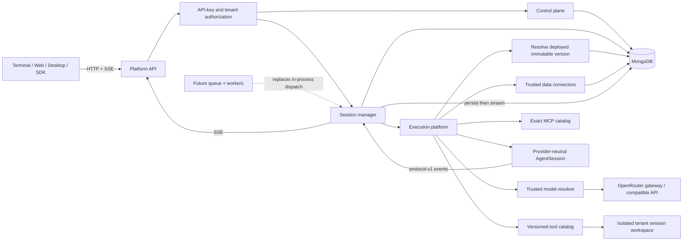

# MongoDB Agent Platform

## Scope

The platform is a control plane and synchronous execution service around the
UI-independent harness. A tenant stores an agent definition in MongoDB, creates
immutable versions, deploys an exact version to an environment, and executes it
through the HTTP/SSE API.

Queue-backed dispatch and separate workers are intentionally deferred. Runs are
currently executed inside the API process through `AgentPlatformSessionManager`.
The persisted run claim and event records provide the boundary that a future
dispatcher/worker implementation will use without changing agent definitions.

## Architecture and execution flow



The database controls which immutable definition is selected. It does not load
executable JavaScript from a record. Provider endpoints, tools, data connector
types, and MCP processes remain trusted service-side capabilities.

## Stored agent definition

Each immutable `agent_versions` document contains:

- model provider, model ID, base URL where applicable, and a secret reference;
- versioned trusted tool bindings and configuration;
- complete versioned skill instructions and tool allowlists;
- inline or connector-backed data-source bindings;
- approved MCP server bindings;
- permission mode, fallback, and rules;
- turn, input, output, total-token, and cost limits;
- arbitrary non-secret metadata.

A `model_providers` record carries its own credential in `apiKey`, alongside the
`model` and the `baseURL` it is sent to. There is no separate secret store and no
environment fallback, so a record without `apiKey` fails the run closed.

### Database hardening prerequisites

One document now holds the credential, the endpoint, and the model, and nothing
outside `model_providers` constrains any of them. Write access to that collection
is therefore equivalent to holding every model credential the platform uses: a
single write can change `baseURL` and send the existing `apiKey` to an endpoint of
the writer's choosing. Before pointing this at anything beyond a local
workstation:

- run MongoDB with authentication and TLS, never an open `127.0.0.1` listener
  reachable from other hosts;
- give the runtime a least-privilege user with read-only access to
  `model_providers`;
- restrict writes to operators, and keep record reads off every client-facing API
  surface, since every read returns a credential;
- enable encryption at rest, and treat a `mongodump` of the collection as a
  credential disclosure;
- rotate by setting a new `apiKey` for the record's `id` in
  `scripts/model/editModel.js`, which replaces the credential in place.

## MongoDB collections

| Collection          | Purpose                                                         |
| ------------------- | --------------------------------------------------------------- |
| `agents`            | Tenant-scoped agent identity and version counter                |
| `agent_versions`    | Immutable executable definitions and SHA-256 checksums          |
| `agent_deployments` | Environment pointer, version ID, and monotonic revision         |
| `platform_audit`    | Agent, version, deployment, rollback, and API-key audit history |
| `platform_api_keys` | SHA-256 key hashes, tenant, roles, use, and revocation state    |
| `model_providers`   | Model, `baseURL`, and `apiKey` per named provider record        |
| `agent_sessions`    | Persisted model messages and agent/deployment metadata          |
| `platform_sessions` | Ownership, hashed control token, environment, and lifecycle     |
| `platform_runs`     | Durable run ID claim and completion state                       |
| `platform_events`   | Ordered protocol-v1 events for replay and idempotency           |

All identity, version, deployment, run, and event paths have tenant-scoped
unique or query indexes. Agent versions have no update operation.

## Start the platform

Requirements:

- Node.js 22+
- MongoDB or MongoDB Atlas
- an OpenRouter or OpenAI-compatible model credential, stored on a
  `model_providers` record by `scripts/model/seedModel.js`

Seed the provider record once, then start the service:

```bash
node scripts/model/seedModel.js

MONGODB_URI='mongodb://127.0.0.1:27017' \
PLATFORM_BOOTSTRAP_API_KEY='replace-with-a-long-random-value' \
PLATFORM_BOOTSTRAP_TENANT='tenant-a' \
npm run platform
```

The default address is `http://127.0.0.1:8788`. Build and run the compiled
service with:

```bash
npm run build
node dist/platform/service-index.js
```

Create and deploy an example agent without a frontend:

```bash
PLATFORM_API_KEY='replace-with-a-long-random-value' \
npm run platform:setup
```

Run the deployed agent by ID or slug and stream its answer:

```bash
PLATFORM_API_KEY='replace-with-a-long-random-value' \
PLATFORM_AGENT='database-agent-...' \
npm run platform:run -- 'Summarize the platform handbook'
```

The demo denies requested mutations by default. Set
`PLATFORM_PERMISSION_DECISION=allow` only in a disposable workspace when you
intend to exercise write or shell tools.

## Authentication and isolation

The bootstrap key is supplied only through the service environment and maps to
an administrator in `PLATFORM_BOOTSTRAP_TENANT`. Administrators can issue
tenant-scoped API keys with `admin`, `editor`, `executor`, or `viewer` roles.
Only API-key hashes are stored.

Session control uses a second random token returned only when the session is
created. Its hash is stored in MongoDB and clients send the token in
`x-agent-control-token`. Platform API authentication continues to use
`Authorization: Bearer <platform-api-key>`.

Every Mongo query used by the platform includes `tenantId`. Workspaces and
artifact directories are separated by tenant and agent. Remote clients cannot
choose a host filesystem path.

## Trusted capability resolution

Database records select capabilities; they do not contain executable tool code.
`TrustedToolCatalog` resolves exact `name@version` pairs registered by the
service. Unknown versions fail closed.

The built-in service registers version `1` of `read_file`, `glob`, `grep`,
`write_file`, `edit_file`, and `bash`. Mutations still pass through the stored
permission policy.

Data sources use registered connector types. The service includes:

- `inline`: documents embedded in the immutable agent version;
- `mongodb-collection`: tenant-filtered documents from a configured collection,
  with unsafe Mongo operators rejected.

MCP bindings require both an administrator-authored version and an exact
`name@version`, transport, command/arguments or URL match in the service
operator's `PLATFORM_MCP_CATALOG_JSON`. This prevents a database author from
reusing an allowed name with a different executable or endpoint.

## Model providers

| Provider value      | Adapter                                                          |
| ------------------- | ---------------------------------------------------------------- |
| `openrouter`        | Default. OpenRouter gateway adapter with attribution + routing   |
| `openai-compatible` | Configurable `/v1/chat/completions` endpoint, `baseURL` required |

`model` is an OpenRouter slug in `vendor/model` form, resolved against the live
`GET /models` catalog. Both adapters normalize streamed text, tool calls, usage,
stop reasons, errors, and cancellation into the harness `ModelProvider`
contract, and streamed tool-call fragments are assembled and JSON-validated
before they enter the agent loop.

## API workflow

1. `POST /v1/agents`
2. `POST /v1/agents/:agent/versions`
3. `POST /v1/agents/:agent/deployments`
4. `POST /v1/agents/:agent/sessions`
5. `POST /v1/sessions/:session/runs` and consume SSE
6. Respond to `permission.requested` through
   `POST /v1/sessions/:session/permissions/:requestId`
7. Replay with `GET /v1/sessions/:session/events?after=<sequence>`
8. Close with `DELETE /v1/sessions/:session`

The same `runId` cannot execute twice. A completed duplicate returns the
persisted events for the original run.

Management reads are available through `GET /v1/agents`, `GET /v1/api-keys`,
`GET /v1/agents/:agent`, `GET /v1/agents/:agent/versions`,
`GET /v1/agents/:agent/deployments`, `GET /v1/sessions`,
`GET /v1/sessions/:session/runs/:runId`, and the event replay endpoint above.
Session listings never expose the stored control-token hash.

## Deferred queue and worker boundary

The future queue implementation will replace synchronous dispatch after a
durable `platform_runs` claim. A worker will reconstruct the deployed agent from
`agent_versions`, execute it, and append to `platform_events`. The API and
control plane do not need to change.

Until then, an API process restart preserves sessions, messages, runs, events,
deployments, and replay data. The next authenticated control request
automatically rehydrates an open session from MongoDB, and platform event
sequences remain monotonic across the restart. At startup, runs left `running`
by the former single API process are marked failed. A permission decision that
was waiting inside a process at the instant it stopped cannot be restored;
retry that run with a new `runId` after inspecting its failed/cancelled state.
Do not run multiple API replicas against the same database until the queue phase
adds worker ownership leases and heartbeats.
