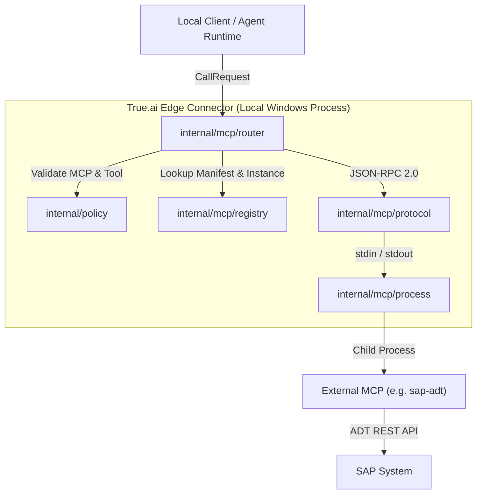

# AGENTS.md — True.ai Edge Connector Agent Guide

> **Scope**: Developer and autonomous agent operating instructions for the `edge-connector` codebase.  
> **Status**: Phase 1 (Local Edge Connector with SAP ADT MCP stdio boundary).

---

## 1. Primary Directives & Boundary Constraints

When modifying or extending this codebase, autonomous agents **must** adhere strictly to the following constraints:

1. **Repository Boundary**:
   - Only modify files inside `edge-connector/`.
   - Never modify `agent-console/`, `agent-harness-clone/`, or root repository files.
   - Do not add dependencies that require elevated (Administrator) Windows privileges.

2. **External MCP as a Black Box**:
   - The target SAP MCP (`https://github.com/fr0ster/mcp-abap-adt.git`) is an external black-box executable.
   - Never clone, fork, vendor, or import SAP ADT source code or internal libraries.
   - Communication is exclusively via the public MCP JSON-RPC 2.0 protocol over `stdio`.

3. **Credential Boundary**:
   - Destination credentials reside at `%USERPROFILE%\Documents\mcp-abap-adt\service-keys\<destination>.json`.
   - The Edge Connector **never** reads, manages, proxies, or logs credentials.
   - All logging is filtered through secret-sanitizing attributes (`internal/logging`).

4. **Deterministic Routing & Safety**:
   - Tool calls must always specify an MCP ID pre-configured in local manifests (`mcp/manifests/*.yaml`).
   - Requests must never accept or pass arbitrary command lines, executables, shell commands, or scripts.

5. **No Cloud / AgentCore Logic**:
   - Edge is a local protocol supervisor and router.
   - Do not implement LLM reasoning, agent loops, context history, sessions, WebSocket gateways, or AWS Bedrock connectors in this component.

---

## 2. Architecture & Component Map



### Key Packages
- [`cmd/edge/main.go`](file:///c:/Users/bdhayalesh/Desktop/Claude-harness/edge-connector/cmd/edge/main.go): Application entrypoint, signal handling, and graceful shutdown sequence.
- [`internal/config`](file:///c:/Users/bdhayalesh/Desktop/Claude-harness/edge-connector/internal/config): Non-admin Windows `%LOCALAPPDATA%\TrueAI\Edge` paths and configuration validation.
- [`internal/logging`](file:///c:/Users/bdhayalesh/Desktop/Claude-harness/edge-connector/internal/logging): Structured `log/slog` logging with automated credential redaction.
- [`internal/mcp/manifest`](file:///c:/Users/bdhayalesh/Desktop/Claude-harness/edge-connector/internal/mcp/manifest): YAML/JSON manifest parsing, timeout rules, and restart policies.
- [`internal/mcp/process`](file:///c:/Users/bdhayalesh/Desktop/Claude-harness/edge-connector/internal/mcp/process): Process manager, stdio piping, crash recovery, exponential backoff, and restart-loop protection.
- [`internal/mcp/protocol`](file:///c:/Users/bdhayalesh/Desktop/Claude-harness/edge-connector/internal/mcp/protocol): Stdio JSON-RPC 2.0 client, initialize handshake, dynamic tool discovery, and cancellation.
- [`internal/mcp/registry`](file:///c:/Users/bdhayalesh/Desktop/Claude-harness/edge-connector/internal/mcp/registry): Manifest indexing and process instance registry.
- [`internal/mcp/router`](file:///c:/Users/bdhayalesh/Desktop/Claude-harness/edge-connector/internal/mcp/router): Deterministic routing pipeline and request lifecycle.
- [`internal/policy`](file:///c:/Users/bdhayalesh/Desktop/Claude-harness/edge-connector/internal/policy): Whitelisting, timeout enforcement, payload size limits, and command injection prevention.
- [`internal/health`](file:///c:/Users/bdhayalesh/Desktop/Claude-harness/edge-connector/internal/health): Local health reporting and status tables.

---

## 3. Development & Testing Commands

Agents can run tests locally using standard Go commands:

```powershell
# Run all unit and integration tests
go test -v ./...

# Run specific package tests
go test -v ./internal/mcp/process
go test -v ./internal/mcp/router

# Run End-to-End integration test
go test -v ./tests
```

All test suites use self-contained mock subprocesses and the fake MCP fixture (`tests/fixtures/fake-mcp`). Real SAP connectivity is never required to pass tests.

