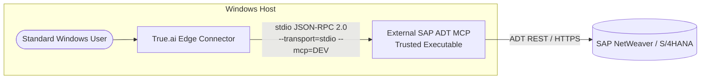
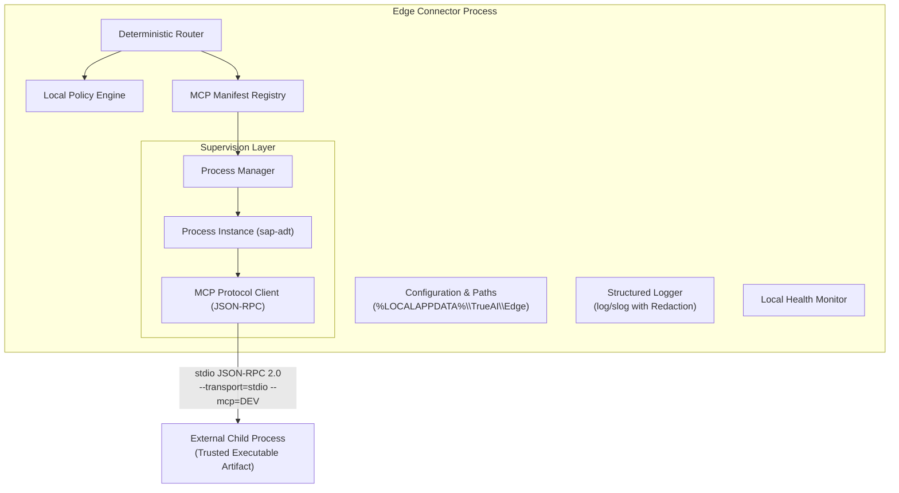
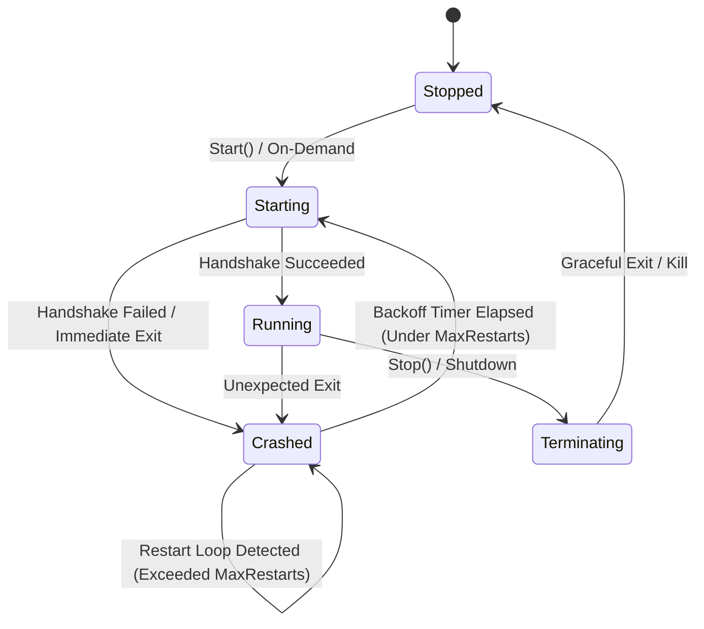
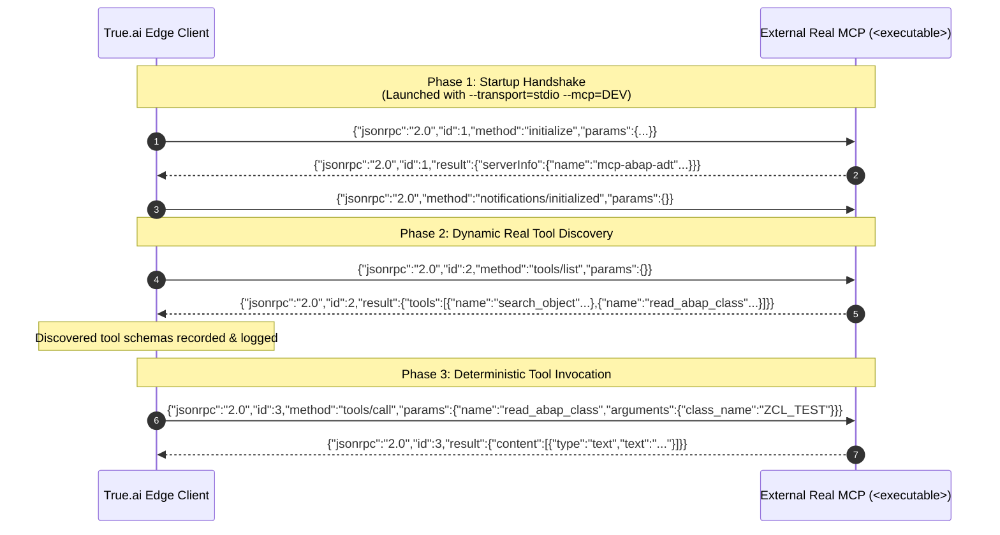
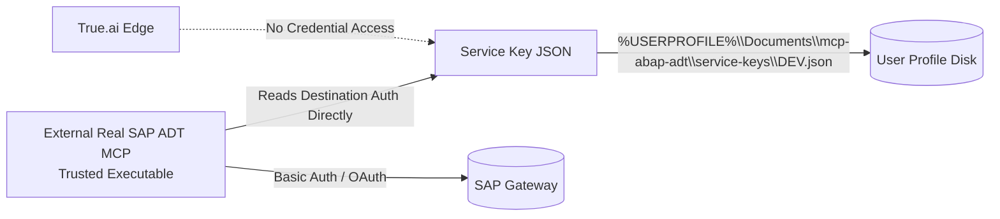

# True.ai Edge Connector Architecture

## Current deployment boundary

```text
CLOUD / AWS: Harness MCP Client -> future EdgeClientTransport -> Edge Server (EC2)
                                                                  |
                                                                 WSS
                                                                  |
CUSTOMER WINDOWS:                                                edge.exe
                                                                  |
                                                             local MCP Router
                                                                  |
                                                        embedded SAP ADT MCP host
                                                                  |
                                                                 SAP
```

`edge-connector/` builds the single customer executable `edge.exe`. `edge-server/` is a separate Go module and server deployment. The server only authenticates, tracks device connections, and forwards opaque MCP JSON-RPC messages. It does not host ADT, execute tools, or use a second cloud MCP client. Harness `EdgeClientTransport` is not implemented yet. The connector initiates the outbound WSS connection and retains local MCP supervision, discovery, policy, and routing.

## 1. Executive Summary

The **True.ai Edge Connector** is a lightweight, high-reliability local daemon written in Go for Windows. It acts as an out-of-process Model Context Protocol (MCP) supervisor, protocol client, and deterministic policy engine. 

Edge runs locally on an enterprise developer's Windows machine to bridge agent workflows to the embedded **SAP ABAP ADT MCP** host without requiring elevated Administrator privileges or exposing corporate SAP credentials to external networks.



---

## 2. Core Responsibilities & Boundaries

### What Edge Does:
- **MCP Registry**: Loads and validates declarative manifests (`mcp/manifests/*.yaml`).
- **Embedded Host Boundary**: The customer build embeds the standalone SAP ADT MCP host into `edge.exe` and extracts it locally at runtime. Optional trusted local executable overrides remain available for development. No separate Node.js/npm/npx/Python/Docker installation is required.
- **Destination Management**: Passes destination identifiers (e.g. `DEV`, `PROD`) strictly via CLI arguments:
  ```
  <executable> --transport=stdio --mcp=<destination>
  ```
  Edge does not inject unverified environment variables such as `SAP_DESTINATION`.
- **Process Supervision**: Spawns, monitors, and recovers child MCP processes via standard input/output.
- **Protocol Boundary**: Implements MCP JSON-RPC 2.0 client specification (`initialize`, `notifications/initialized`, `tools/list`, `tools/call`, `$/cancelRequest`).
- **Dynamic Tool Discovery**: Queries tool schemas dynamically at startup via `tools/list`, logs schemas, and caches them in memory.
- **Deterministic Routing**: Routes tool execution calls strictly through verified manifests and registered instances.
- **Local Policy Engine**: Enforces allowed MCP IDs, tool whitelists, request timeouts, and maximum response buffer sizes.
- **Crash Recovery**: Enforces exponential backoff and restart-loop protection to prevent resource exhaustion.
- **Health & Diagnostics**: Exposes point-in-time process metrics (PID, state, uptime, restart counts, last exit code).
- **Graceful Shutdown**: Intercepts OS signals (`SIGINT`, `SIGTERM`), halts incoming requests, awaits in-flight executions, and gracefully terminates child processes.

### What Edge Does NOT Do:
- **No Node.js/npx Runtime Requirement**: Edge does not require the customer to install Node.js, npm, npx, Python, or Docker.
- **No Unverified Environment Variables**: Edge does not inject `SAP_DESTINATION` or other unverified env vars.
- **No LLM / Reasoning**: Edge does not call Bedrock, OpenAI, or run inference loops.
- **No Agent Loops**: No agent prompt orchestration or session management.
- **Outbound Connection Only**: Edge opens a WebSocket client connection to the separate Edge Server. It does not host the cloud gateway or listen for public inbound connections.
- **No SAP ADT Re-implementation**: Edge does not speak RFC or ADT directly; it treats `mcp-abap-adt` as an opaque black box.
- **No Credential Handling**: Edge does not read, store, proxy, or log SAP service keys.

---

## 3. Detailed Component Architecture



---

## 4. MCP Process Lifecycle & Supervision

Every configured MCP process is managed as a supervised child process with full lifecycle tracking:



### Crash Recovery & Restart-Loop Protection
- **Failure Window**: Configurable sliding window (e.g. 60 seconds).
- **Restart Threshold**: Configurable limit (e.g. 5 crashes). If crashes exceed this count within the window, Edge permanently enters `Crashed` state and halts auto-restarting.
- **Exponential Backoff**: Calculation: `backoff = min(initialBackoff * 2^(crashCount - 1), maxBackoff)`. Prevents hammering the OS or consuming CPU during unrecoverable failures.

---

## 5. MCP Protocol Handshake & Tool Invocation



---

## 6. Windows Non-Admin Security Model

Edge is explicitly engineered to run under a standard, unprivileged Windows user account:

1. **Filesystem Boundaries**:
   - Runtime state: `%LOCALAPPDATA%\TrueAI\Edge\state`
   - Diagnostic logs: `%LOCALAPPDATA%\TrueAI\Edge\logs`
   - Manifest overrides: `%LOCALAPPDATA%\TrueAI\Edge\manifests`
   - Trusted binary directory: `%LOCALAPPDATA%\TrueAI\Edge\bin`
   - Any paths targeting `C:\Windows`, `C:\Program Files`, or `C:\ProgramData` are rejected at startup.

2. **No Elevated Privileges**:
   - No Windows Service registration.
   - No registry writes to `HKEY_LOCAL_MACHINE`.
   - Runs interactively or as a user startup task.

3. **Arbitrary Execution Defense**:
   - Manifests strictly declare the executable and arguments.
   - Incoming router requests cannot supply executables, scripts, or shell commands.
   - Special characters (`|`, `&`, `;`, `$`, `` ` ``) are prohibited in manifest executables, arguments, and destination names.

---

## 7. Credential Boundary



The external ADT MCP relies on destination-based authentication stored in the user profile directory. Edge does not participate in this authentication path, ensuring complete credential segregation.
