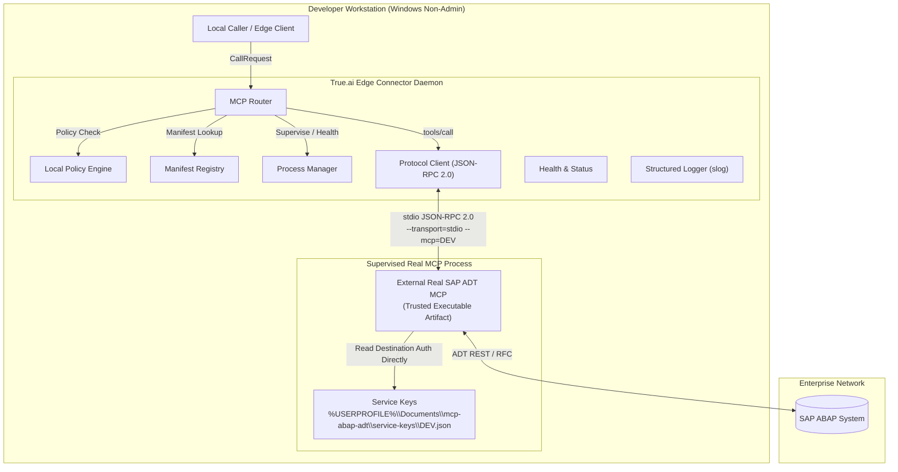
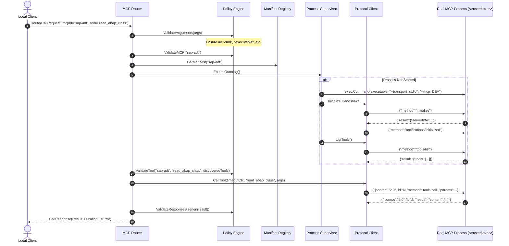

# System Architecture: True.ai Edge Connector

## 1. System Context & High-Level Architecture

The **True.ai Edge Connector** provides a local execution gateway on Windows workstations for interacting with enterprise systems through the Model Context Protocol (MCP). It manages child MCP processes communicating over standard input/output (`stdio`), specifically bridging to the real external **SAP ABAP ADT MCP** server via trusted local configuration.

---

## 2. Component Breakdown

### 2.1 Configuration & Path Management (`internal/config`)
- Discovers user-writable paths dynamically using `%LOCALAPPDATA%\TrueAI\Edge`.
- Establishes segregated directories:
  - `state/`: ephemeral runtime state and health locks.
  - `logs/`: structured application and crash logs.
  - `bin/`: location for externally supplied MCP executables.
  - `manifests/`: optional user manifest overrides.
- Manages destination selection (default: `DEV`) via config file, `--destination` CLI flag, or `TRUEAI_SAP_DESTINATION`.
- Explicitly forbids targeting Windows system directories (`C:\Windows`, `C:\Program Files`).

### 2.2 MCP Manifest & Registry (`internal/mcp/manifest`, `internal/mcp/registry`)
- Manifests define executable metadata, destination, arguments, timeouts, restart policies, and tool whitelists.
- Executable resolution automatically locates binaries in `%LOCALAPPDATA%\TrueAI\Edge\bin\` or system `PATH`.
- Eliminates Node.js/npx runtime requirements from production manifests without claiming an official upstream `.exe` exists. Production packaging remains an open deployment decision.
- The registry indexes manifests by unique MCP ID.
- Rejects arbitrary command injection strings during parsing.

### 2.3 Process Supervision Layer (`internal/mcp/process`)
- Manages the lifecycle of MCP child processes:
  - Spawns process using `os/exec.Command`.
  - Injects transport and destination strictly via CLI arguments: `--transport=stdio --mcp=<destination>`.
  - Does not inject unverified environment variables such as `SAP_DESTINATION`.
  - Captures `stdin`, `stdout`, and `stderr`.
  - Drains `stderr` into structured application logs.
  - Detects unexpected termination and applies exponential backoff restart.
  - Detects restart loops and halts runaway process spawning.

### 2.4 MCP Protocol Client (`internal/mcp/protocol`)
- Implements MCP 2024-11-05 specification over newline-delimited JSON-RPC 2.0.
- Handles atomic request-response correlation.
- Executes `initialize` handshake and sends `notifications/initialized`.
- Dynamically queries available tools via `tools/list` and records tool schemas.
- Dispatches tool executions via `tools/call`.
- Emits `$/cancelRequest` upon client context expiration.

### 2.5 Local Policy Engine (`internal/policy`)
- Enforces strict execution boundaries before requests reach child processes.
- Verifies:
  1. Permitted MCP ID (`sap-adt`).
  2. Permitted tool name (against dynamic discovery and configured whitelist/wildcard).
  3. Clean execution arguments (rejects any attempt to pass `cmd`, `powershell`, `executable`, etc.).
  4. Max response size limits (default: 10 MB) to prevent denial-of-service via memory exhaustion.

### 2.6 Deterministic Router (`internal/mcp/router`)
- Orchestrates the full request lifecycle:
  - Validates request format and safety.
  - Checks policy and manifest existence.
  - Ensures target MCP process is running.
  - Dispatches `tools/call` over protocol client with timeout bounds.
  - Validates response size and returns structured result.

---

## 3. Request Flow Diagram

