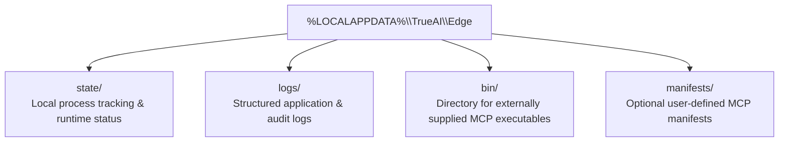

# Configuration Reference: True.ai Edge Connector

## Interactive SAP setup

Run `edge.exe` to configure email and, if needed, an on-premise SAP connection.
`edge.exe --setup` asks for email and SAP details again. `edge.exe
--change-account` changes the email while retaining the device ID and SAP
settings. Password entry disables console echo on Windows.

The ordinary identity and server configuration is stored at
`%LOCALAPPDATA%\TrueAI\Edge\config.json`. Non-secret SAP connection fields
(URL, client, username, basic/http/onprem mode) are stored separately at
`%LOCALAPPDATA%\TrueAI\Edge\sap_config.json`. With `--config <path>`, the SAP
file lives beside that file. The SAP password is a **Generic Credential** in
the current Windows user's Credential Manager vault under a target beginning
`TrueAI/Edge/SAP/`; the remainder is a hash of the config path. It is never
written to either JSON file.

At each MCP launch, Edge obtains the password from Credential Manager and
creates a restricted, short-lived `sap-runtime-*.env` file in the configured
state directory. The embedded `sap-adt-host.exe` reads that file via
`--env-path`. Edge deletes it immediately after MCP handshake and tool
discovery. Supervisor restarts create a fresh file and delete it the same way.
An abrupt Edge process termination during startup can leave this temporary
file behind. Edge removes launch files older than one minute on the next
startup; clear the state directory before sharing or backing it up. The file
is never sent to the Edge Connection Server.

Connectivity is verified with a read-only `GetPackage` call for `BASIS`, after
the discovered schema is checked for the expected `package_name` argument.
MCP startup and tool discovery alone do not produce a SAP success message.
The Edge Server receives only the existing registration identity and heartbeat
payloads; no SAP settings or credentials are included.

## 1. Non-Admin Windows Directory Model

True.ai Edge is designed specifically for standard, non-elevated Windows user environments. It never requires Administrator privileges.



### Directory Locations
| Component | Default Path | Purpose |
|---|---|---|
| **Base Directory** | `%LOCALAPPDATA%\TrueAI\Edge\` | Root per-user directory |
| **State Directory** | `%LOCALAPPDATA%\TrueAI\Edge\state\` | Runtime process metadata |
| **Logs Directory** | `%LOCALAPPDATA%\TrueAI\Edge\logs\` | Structured log files |
| **Bin Directory** | `%LOCALAPPDATA%\TrueAI\Edge\bin\` | Location for external MCP binary |
| **Manifests** | `./mcp/manifests` or `%LOCALAPPDATA%\TrueAI\Edge\manifests\` | MCP declaration files |

---

## 2. Configuration Parameters

Configuration can be supplied via a JSON file (passed via `--config <path>`), environment variables, or CLI arguments:

The default customer path uses the embedded `sap-adt-host.exe` and the
interactive setup above. The optional executable and env-path fields below
remain for developer and integration workflows.

```json
{
  "manifestDir": "mcp/manifests",
  "stateDir": "C:\\Users\\User\\AppData\\Local\\TrueAI\\Edge\\state",
  "logDir": "C:\\Users\\User\\AppData\\Local\\TrueAI\\Edge\\logs",
  "logLevel": "info",
  "logJSON": true,
  "destination": "DEV",
  "sapExecutable": "mcp-abap-adt",
  "sapEnvPath": ".\\DEV.env",
  "sapSystemType": "onprem",
  "shutdownTimeout": "15s",
  "defaultRequestTimeout": "30s",
  "maxResponseSizeBytes": 10485760
}
```

### Options Description
- **`destination`** (`string`): Target SAP destination identifier (e.g. `"DEV"`, `"PROD"`). Passed to ADT MCP via `--mcp=<destination>` when destination mode is used.
- **`sapExecutable`** (`string`): Optional explicit executable name or path for the ADT MCP binary.
- **`sapEnvPath`** (`string`): Local path to external MCP environment configuration file (e.g. `.\DEV.env`). Edge resolves relative paths locally to absolute paths and passes `--env-path=<resolved-path>` to the child process without reading or parsing the file.
- **`sapSystemType`** (`string`): System type passed to ADT MCP (e.g. `"onprem"`), passed via `--system-type=<systemType>`.
- **`manifestDir`** (`string`): Path to folder containing `.yaml` or `.json` MCP manifests.
- **`stateDir`** (`string`): User-writable state directory.
- **`logDir`** (`string`): User-writable logging directory.
- **`logLevel`** (`string`): Logging verbosity: `"debug"`, `"info"`, `"warn"`, `"error"`.
- **`logJSON`** (`bool`): When `true`, outputs structured JSON logs. When `false`, outputs formatted text.
- **`shutdownTimeout`** (`duration`): Maximum grace period to wait for in-flight requests and child process shutdown.
- **`defaultRequestTimeout`** (`duration`): Fallback timeout for tool execution if not defined in manifest.
- **`maxResponseSizeBytes`** (`int64`): Maximum allowed size in bytes for a tool response payload (default: 10MB).

---

## 3. Command-Line Arguments & Environment Variables

| CLI Flag | Environment Variable | Config Property | Description |
|---|---|---|---|
| `--destination` | `TRUEAI_SAP_DESTINATION` | `destination` | Active SAP destination (e.g. `DEV`, `PROD`) |
| `--sap-executable` | `TRUEAI_SAP_EXECUTABLE` | `sapExecutable` | Path or name of real ADT MCP binary |
| `--sap-env-path` | `TRUEAI_SAP_ENV_PATH` | `sapEnvPath` | Path to local env file passed to MCP child process |
| `--sap-system-type` | `TRUEAI_SAP_SYSTEM_TYPE` | `sapSystemType` | System type argument passed to MCP child process |
| `--describe-tool` | - | - | Print description and input schema for specified MCP tool and exit |
| `--call-tool` | - | - | Execute specified MCP tool and exit |
| `--call-args` | - | - | JSON arguments string for `--call-tool` |
| `--manifests` | `TRUEAI_MANIFEST_DIR` | `manifestDir` | Path to manifest directory |
| `--log-level` | `TRUEAI_LOG_LEVEL` | `logLevel` | Logging level (`debug`, `info`, `warn`, `error`) |
| `--config` | - | - | Path to custom `config.json` file |

---

## 4. MCP Manifest Schema: `mcp/manifests/sap-adt.yaml`

```yaml
# Unique identifier matching router requests
id: sap-adt

# Descriptive human-readable name
name: SAP ABAP ADT MCP

# Version of the MCP server
version: 1.0.0

# Transport mechanism (stdio is supported)
transport: stdio

# Externally supplied trusted executable artifact
executable: mcp-abap-adt

# System type for on-premise SAP connectivity
systemType: onprem

# Local configurable env-file path (also accepts alias envFile:)
# Relative paths are resolved locally by Edge; absolute Windows paths are preserved.
envPath: .\DEV.env

# Additional trusted CLI arguments
arguments:
  - "--transport=stdio"

# Startup timeout (for initialize and dynamic tools/list)
startupTimeout: 30s

# Request execution timeout
requestTimeout: 60s

# Supervision and crash recovery parameters
restartPolicy:
  maxRestarts: 5
  crashWindow: 60s
  initialBackoff: 1s
  maxBackoff: 30s

# Tool access whitelist ("*" allows all dynamically discovered tools)
allowedTools:
  - "*"
```

Effective invocation executed by Edge:
```powershell
<executable> --transport=stdio --env-path=<resolved-path> --system-type=onprem
```
When destination is configured:
```powershell
<executable> --transport=stdio --env-path=<resolved-path> --system-type=onprem --mcp=DEV
```
For an explicitly supplied `--sap-env-path`, Edge passes the path to the host
without reading or parsing that file. Interactive setup generates the
short-lived file described above. Neither path sends SAP credentials through
the WebSocket connection.
