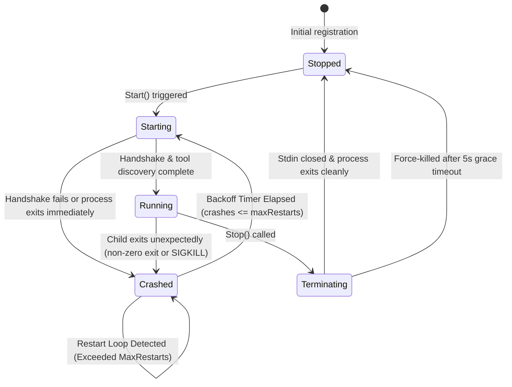
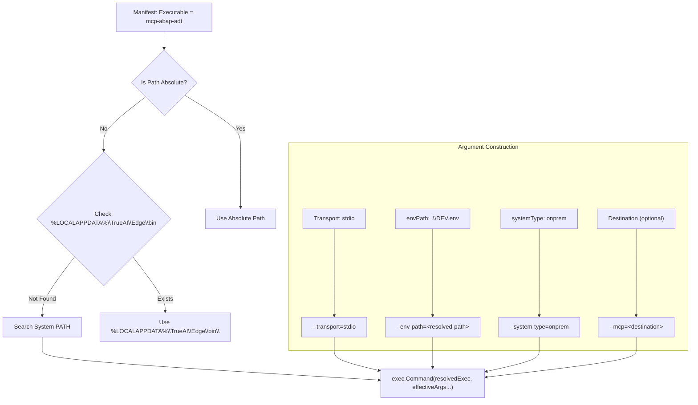

# MCP Runtime & Process Supervision

## 1. Overview

The **MCP Runtime** inside True.ai Edge manages child MCP processes as external, out-of-process subprocesses. The runtime is responsible for:
- Executable resolution prioritizing externally supplied binaries without requiring Node.js, npm, npx, Python, or Docker. No official `.exe` from upstream is assumed.
- Destination injection strictly via CLI arguments: `--transport=stdio --mcp=<destination>`.
- Process lifecycle management (`Start`, `Stop`, `Restart`, `Status`).
- Bidirectional JSON-RPC 2.0 communication over standard input (`stdin`) and output (`stdout`).
- Child diagnostic capturing over standard error (`stderr`).
- Process crash detection and recovery with exponential backoff.
- Restart-loop protection to prevent runaway process flapping.

---

## 2. Process Lifecycle State Machine



### State Definitions
- **`stopped`**: The process is not executing. No PID is allocated.
- **`starting`**: Process has been launched via `exec.Cmd.Start()`; handshake (`initialize`) and `tools/list` are in progress.
- **`running`**: Handshake succeeded; process is actively ready to accept `tools/call` requests.
- **`terminating`**: Graceful stop in progress. Standard input has been closed; supervisor is awaiting exit.
- **`crashed`**: Process exited unexpectedly. Supervisor evaluates crash history against the restart policy.

---

## 3. Real MCP Executable Resolution & Launch



Edge does **not** inject unverified environment variables such as `SAP_DESTINATION`, nor does Edge read, parse, or transmit the contents of the configured env file. The external MCP owns credential handling and SAP connectivity.

---

## 4. Crash Recovery & Restart-Loop Protection

When a running process exits unexpectedly, the supervisor calculates backoff and ensures the process is not trapped in an unrecoverable restart loop:

```mermaid
flowchart TD
    Crash[Process Exits Unexpectedly] --> LogError[Record exit code and error]
    LogError --> AddTimestamp[Append timestamp to crash history]
    AddTimestamp --> Prune[Prune crashes older than CrashWindow]
    Prune --> CountCheck{Crash Count > MaxRestarts?}
    
    CountCheck -->|Yes| Engaged[Engage Restart-Loop Protection]
    Engaged --> SetCrashed[State: Crashed<br/>Error: restart loop detected]
    Engaged --> Abort[Halt automatic restarts]
    
    CountCheck -->|No| CalcBackoff["Calculate Exponential Backoff<br/>backoff = min(initialBackoff * 2^(count-1), maxBackoff)"]
    CalcBackoff --> Sleep[Wait for backoff duration]
    Sleep --> Restart[Attempt Start()]
```

---

## 5. Dynamic Tool Discovery

Upon startup, the supervisor invokes `tools/list` on the child process:
- All tools exposed by the MCP server are inspected.
- Tool names, descriptions, and input schemas are recorded into the managed instance.
- Tool discovery is logged at `INFO` (summary) and `DEBUG` (detailed schemas).
- The router references these dynamically discovered tools for request validation.
