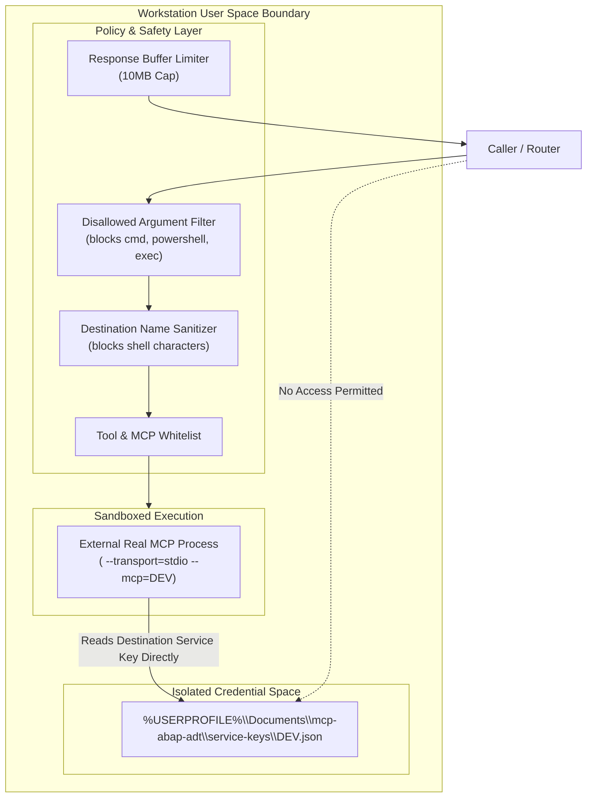

# Security Architecture & Boundaries: True.ai Edge Connector

## 1. Security Principles

The security design of True.ai Edge is built upon four fundamental principles:
1. **Least Privilege**: Zero requirement for administrative privileges on Windows.
2. **Credential Segregation**: Edge never reads, stores, proxies, or logs credentials.
3. **Execution Safety**: Execution is strictly deterministic; arbitrary shell or process execution is physically prevented.
4. **Denial of Service Defense**: Memory bounds and restart backoffs prevent runaway resource consumption.



---

## 2. Windows Non-Admin Security Model

True.ai Edge executes exclusively in the user-context of the logged-in Windows user:
- **No Windows Service**: Does not register as a background service running under `NT AUTHORITY\SYSTEM` or `LocalService`.
- **No Machine Registry Modification**: No access or mutation of `HKEY_LOCAL_MACHINE`.
- **User-Restricted Filesystem**: All persistent state and logs reside within `%LOCALAPPDATA%\TrueAI\Edge`, which is ACL-restricted by default in Windows to the current user and administrators.
- **Directory Validation**: Attempts to configure system directories (e.g. `C:\Windows`, `C:\Program Files`, `C:\ProgramData`) fail during startup validation.

---

## 3. Credential Boundary & Segregation

The external SAP ADT MCP uses destination-based authentication:
- Service keys are stored in:
  ```
  %USERPROFILE%\Documents\mcp-abap-adt\service-keys\<destination>.json
  ```
- **Edge Zero-Knowledge Guarantee**:
  - The Edge Connector **never** opens, reads, parses, or caches these files.
  - The Edge Connector does not pass authentication headers or credentials in JSON-RPC parameters.
  - Authentication occurs strictly between the child MCP process and the remote SAP server.
- **Automated Log Redaction**:
  - The logging package (`internal/logging`) inspects all structured log fields.
  - Any keys or values resembling `password`, `token`, `secret`, `service_key`, or `credentials` are redacted to `[REDACTED]`.

---

## 4. Protection Against Arbitrary Command Execution

The Edge Connector enforces strict deterministic routing:

1. **Static Manifest Binding**:
   - Only processes defined in vetted, local YAML manifests can be executed.
   - Manifest definitions cannot be created or modified via runtime API calls.

2. **Prohibited Execution Parameters**:
   - The policy engine inspects incoming tool call parameters. If any parameter key contains:
     `executable`, `cmd`, `command`, `shell`, `powershell`, `bash`, `python`, `script`
   - The request is immediately rejected with `ErrDisallowedParameter` and an audit security event is logged.

3. **Shell Operator & Destination Proscription**:
   - Manifest executables, arguments, and destination names are validated against shell metacharacters:
     ```
     [;&|<>$`\n\r]
     ```
   - Destination strings must strictly conform to `^[a-zA-Z0-9_\-\.]+$`.
   - This prevents argument injection or command chaining when launching the child process.

---

## 5. Denial-of-Service (DoS) Protections

1. **Max Response Payload Limit**:
   - Responses from child MCP processes are limited by `MaxResponseSizeBytes` (default: 10 MB).
   - If an external process returns an unbounded or massive result, it is rejected with `ErrResponseTooLarge`, protecting the system from Out-Of-Memory (OOM) crashes.

2. **Restart-Loop Protection**:
   - Prevents flapping processes from consuming 100% CPU.
   - If a process crashes repeatedly, an exponential backoff is applied (up to 30 seconds).
   - If crashes exceed `MaxRestarts` (e.g. 5) within the `CrashWindow` (e.g. 60 seconds), automatic restarts are permanently halted until manual review.
