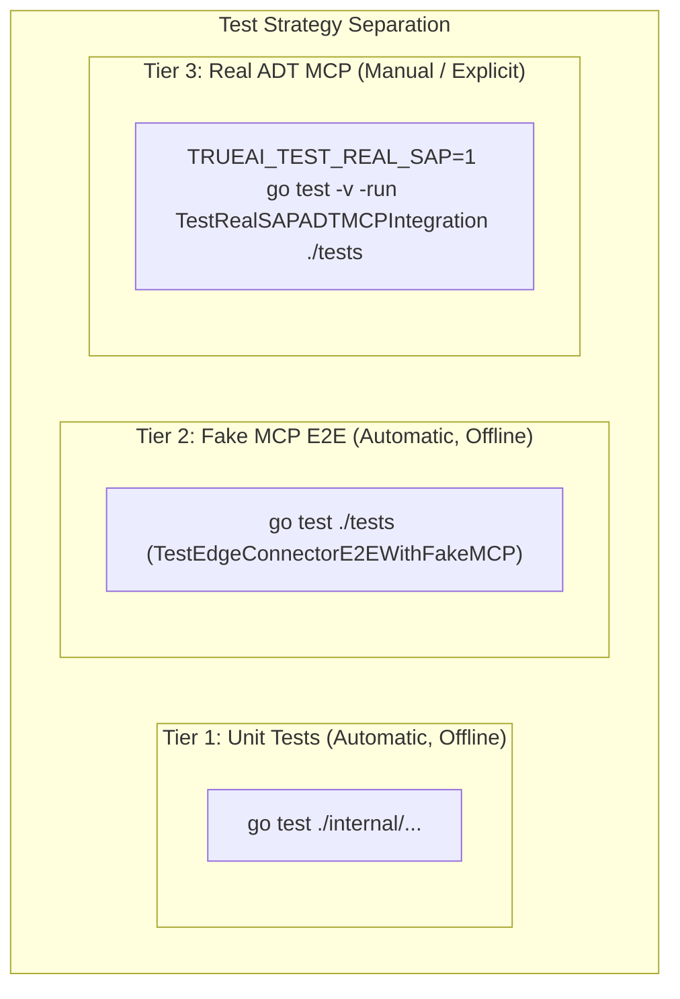

# Testing Strategy & Verification: True.ai Edge Connector

## 1. Testing Philosophy

The test suite for True.ai Edge is engineered with a strict 3-tier separation:
1. **Unit Tests**: Test core components (`config`, `health`, `logging`, `manifest`, `process`, `protocol`, `policy`, `router`) completely in-memory.
2. **Fake MCP E2E Tests**: Test full system workflow against a self-contained simulated MCP binary (`tests/fixtures/fake-mcp`). Runs automatically offline with `go test ./...`.
3. **Real SAP ADT MCP Integration Tests**: Manual/explicit integration tests connecting to the externally supplied ADT MCP executable (`tests/real_mcp_test.go`). Decoupled from automated CI/CD and requires explicit opt-in via `TRUEAI_TEST_REAL_SAP=1`.



---

## 2. Real vs Fake MCP Comparison

| Capability | Fake MCP (`tests/fixtures/fake-mcp`) | Real SAP ADT MCP |
|---|---|---|
| **Role** | Local developer & CI/CD verification | Production SAP connectivity |
| **Dependencies** | None (pure Go fixture) | Externally supplied executable artifact |
| **Credentials** | None | Reads `%USERPROFILE%\Documents\mcp-abap-adt\service-keys\<destination>.json` |
| **SAP System Required** | No | Yes (NetWeaver / S/4HANA / BTP) |
| **Executed In Default `go test`** | Yes | No (Skips automatically unless opted-in) |
| **Tools Exposed** | Simulated (`read_abap_class`, `list_packages`) | Real ADT tools dynamically discovered |
| **Invocation** | `<fake-mcp.exe>` | `<executable> --transport=stdio --mcp=<destination>` |

---

## 3. Running Automated Tests (Offline)

### Run Entire Suite (Unit + Fake MCP E2E)
```powershell
go test -count=1 ./...
```

### Run Static Analysis
```powershell
go vet ./...
```

---

## 4. Repeatable Executable-Level MCP Testing (edge.exe + fake-mcp.exe)

This procedure demonstrates that the compiled `edge.exe` binary operates an external MCP child process directly over standard `stdio` JSON-RPC 2.0.

### Step 1: Build Both Executables
```powershell
# Build True.ai Edge Connector binary
go build -o edge.exe ./cmd/edge

# Build External Fake MCP binary
go build -o fake-mcp.exe ./tests/fixtures/fake-mcp
```

### Step 2: Test External Process Tool Execution & Clean Shutdown
```powershell
.\edge.exe --sap-executable .\fake-mcp.exe --destination DEV --call-tool read_abap_class --call-args '{\"class_name\":\"ZCL_CUSTOMER_INVOICE\"}'
```

### Step 3: Test Process Crash Detection & Supervisor Automatic Restart
```powershell
.\edge.exe --sap-executable .\fake-mcp.exe --destination DEV --test-restart
```

---

## 5. Manual Verification Against Real SAP ADT MCP

### Step 1: Place the Real MCP Binary
Ensure the externally supplied MCP executable is in:
- `%LOCALAPPDATA%\TrueAI\Edge\bin\`
- or in your system `PATH`
- or supply explicit path via `$env:TRUEAI_SAP_EXECUTABLE="C:\path\to\mcp-abap-adt"`

### Step 2: Configure SAP Destination Service Key
Ensure your SAP service key file is present at:
```
%USERPROFILE%\Documents\mcp-abap-adt\service-keys\<destination>.json
```
For example, for destination `DEV`:
```
%USERPROFILE%\Documents\mcp-abap-adt\service-keys\DEV.json
```

### Step 3: Run the Integration Test
```powershell
$env:TRUEAI_TEST_REAL_SAP="1"
$env:TRUEAI_SAP_DESTINATION="DEV"

go test -v -run TestRealSAPADTMCPIntegration ./tests
```

### Step 4: Build and Run Live Application
```powershell
# Build standalone Windows executable
go build -o edge.exe ./cmd/edge

# Run binary with target destination
.\edge.exe --destination DEV --log-level debug
```
Effective invocation executed by Edge:
```
<executable> --transport=stdio --mcp=DEV
```
Edge does not inject unverified environment variables such as `SAP_DESTINATION`.
